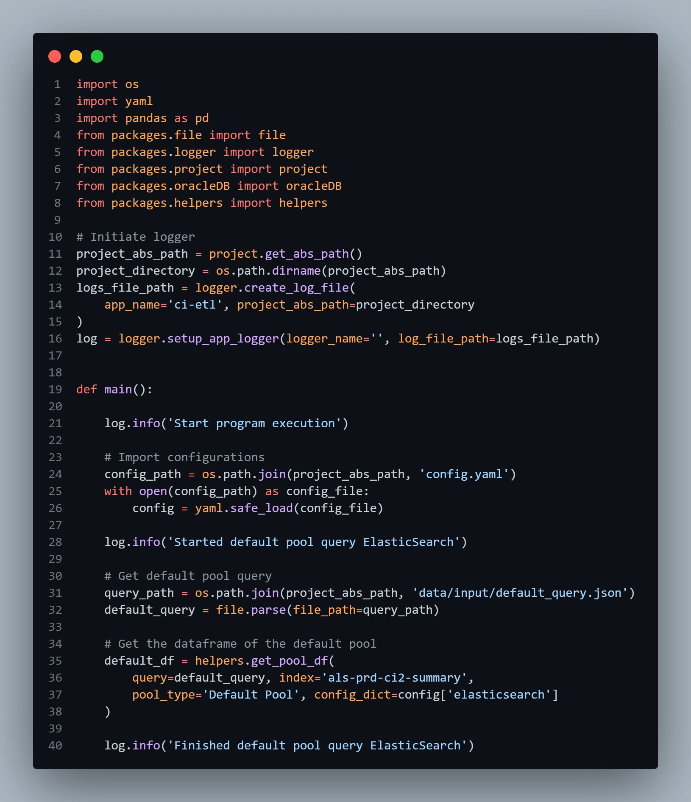
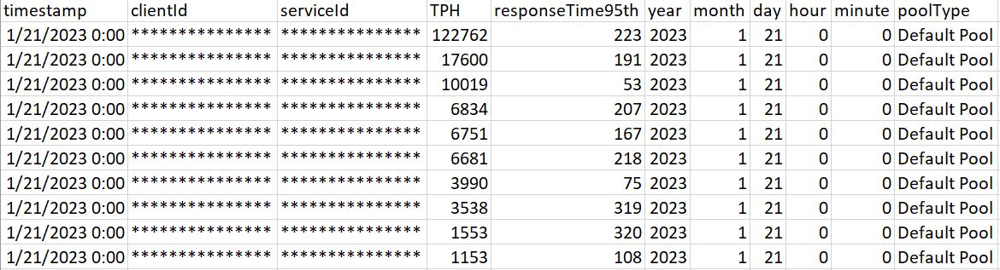
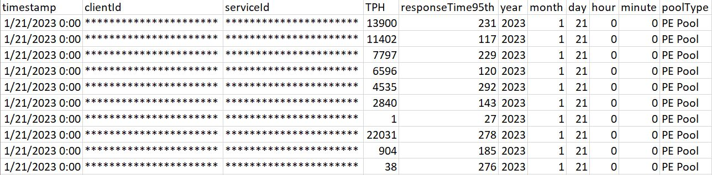
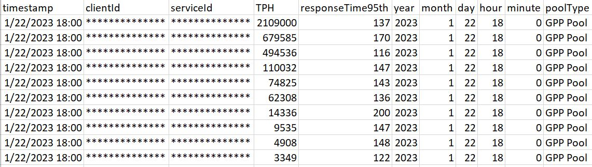

<!-- PROJECT SHIELDS -->
<!--
*** I'm using markdown "reference style" links for readability.
*** Reference links are enclosed in brackets [ ] instead of parentheses ( ).
*** See the bottom of this document for the declaration of the reference variables
*** for contributors-url, forks-url, etc. This is an optional, concise syntax you may use.
*** https://www.markdownguide.org/basic-syntax/#reference-style-links
-->

<a name="readme-top"></a>

[![LinkedIn][linkedin-shield]][linkedin-url]

<!-- PROJECT LOGO -->
<br />
<div align="center">
    

  <h3 align="center">Charging Interface Capacity ETL Pipeline</h3>

</div>

<!-- TABLE OF CONTENTS -->
<details>
  <summary>Table of Contents</summary>
  <ol>
    <li>
      <a href="#about-the-project">About The Project</a>
      <ul>
        <li><a href="#built-with">Built With</a></li>
      </ul>
    </li>
    <li>
      <a href="#getting-started">Getting Started</a>
      <ul>
        <li><a href="#libraries">Libraries</a></li>
        <li><a href="#packages">Packages</a></li>
        <li><a href="#service-accounts">Service Accounts</a></li>
        <li><a href="#known-exceptions">Known Exceptions</a></li>
      </ul>
    </li>
    <li><a href="#usage">Usage</a></li>
    <li><a href="#roadmap">Roadmap</a></li>
  </ol>
</details>

<!-- ABOUT THE PROJECT -->

## About The Project



- Project Name: Charging Interface Capacity ETL Pipeline
- Version: V1.0.0
- Organization Department: Technology

### Description

An ETL pipeline that is developed in Python and SQL to perform the following tasks:
* Extracts three pools of data from ElasticSearch.
* Transforms a timestamp column to Year, Month, Day, Hour, Minute columns.
* Adds a column `poolType` with static value representing the pool of data, e.g. Default pool, PE pool or GPP pool.
* Load the data into one table in an Oracle database.

The pipeline is scheduled to run daily at 9 AM using the crontab in Linux.

Impact: The retention period in ElasticSearch is not enough for the capacity
team to make their assessments; so the ETL pipeline will allow them to 
retain the data in their database for years; allowing a better capacity assessment.

<p align="right">(<a href="#readme-top">back to top</a>)</p>

### Built With

This project was developed using the following tech stacks:

- Python
- SQL

<p align="right">(<a href="#readme-top">back to top</a>)</p>

<!-- GETTING STARTED -->

## Getting Started

In this section, I will give you instructions on setting up this project locally.
To get a local copy up and running follow these simple steps.

### Libraries

- pip
  ```sh
  pip install cx-Oracle==8.3.0
  ```
  ```sh
  pip install elasticsearch~=7.16.2
  ```
  ```sh
  pip install pandas~=1.1.5
  ```
  ```sh
  pip install PyYAML~=6.0
  ```


### Packages

* Elasticsearch 
* OracleDB 
* Logger 
* Timestamp
* Project
* File 
* Helpers

### Service Accounts

- None

### Known Exceptions

- None

<p align="right">(<a href="#readme-top">back to top</a>)</p>

<!-- USAGE EXAMPLES -->

## Usage

### Screenshots

#### Default Pool



#### PE Pool



#### GPP Pool


<p align="right">(<a href="#readme-top">back to top</a>)</p>

<!-- ROADMAP -->

## Roadmap

- [x] Extract the data from Elasticsearch
- [x] Transform the data as required
- [x] Load the data into the Oracle database
- [x] Add logs for each step.
- [x] Capture unexpected errors in logs.
- [x] Schedule the project to run in the Crontab daily.

<p align="right">(<a href="#readme-top">back to top</a>)</p>


<!-- CONTACT -->
## Contact

Mohamed AbdelGawad Ibrahim - [@m-abdelgawad](https://www.linkedin.com/in/m-abdelgawad/) - <a href="tel:+201069052620">+201069052620</a>

<p align="right">(<a href="#readme-top">back to top</a>)</p>


<!-- MARKDOWN LINKS & IMAGES -->
<!-- https://www.markdownguide.org/basic-syntax/#reference-style-links -->

[linkedin-shield]: https://img.shields.io/badge/-LinkedIn-black.svg?style=for-the-badge&logo=linkedin&colorB=555
[linkedin-url]: https://www.linkedin.com/in/m-abdelgawad/